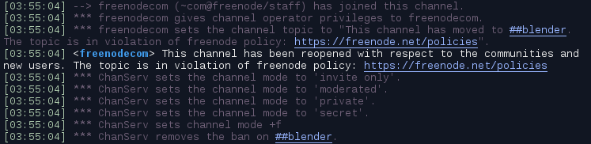

## The Future of #blender on Freenode

### Short version

**#blender** on Freenode will continue for the time being.

But because of the actions by Freenode's new management on the 25th May which included locking the channel and removing all operators/moderators without notice or warning (an action that similarly affected many other channels), it's recommended that users use the new **#blender** channel on [Libera.Chat IRC](https://libera.chat/) where possible.

Libera network settings:
* Server: irc.libera.chat:6697 (SSL)
* Channels: #blender, #blenderchat
* Web access: https://web.libera.chat/?nick=user&channel=#blender
* Registration not usually required (but recommended).

Libera has been set up by a number of ex-Freenode staff and is now the official place for a number of projects including Ubuntu, Gentoo, Wikimedia, LibreOffice, Ffmpeg and others.

Related links: 
https://lists.debian.org/debian-devel-announce/2021/06/msg00002.html 
https://lists.ubuntu.com/archives/ubuntu-irc/2021-May/001927.html 
https://www.gentoo.org/news/2021/05/23/Moving-to-Libera.html 
https://communityblog.fedoraproject.org/irc-announcement/ 
https://wiki.freebsd.org/IRC/Official-FreeBSD-IRC-channels-now-on-Libera-Chat 
https://blog.documentfoundation.org/blog/2021/05/31/libreoffice-irc-channels-moving-to-libera-chat/ 
https://meta.wikimedia.org/wiki/IRC/Migrating_to_Libera_Chat 

### Background

On the 25th May 2021 at 2:55am UTC, the **#blender** channel on Freenode was effectively closed. All of the channel operators had their access controls revoked, the room was locked and the topic changed. Users were then redirected to a different unmoderated channel - **##blender**. The channel log of the event (timestamps BST):

A few hours later, the channel was reinstated by a staff member on appeal. Unfortunately all the previous configurations and assigned operators were lost and had to be reinstated manually.

Many other project channels were affected at the same time.

Freenode's new management has [since stated](https://freenode.net/news/post-mortem-may21) their intention was to deal with channels that were preventing users from communicating or forcing them onto other services. But instead, a large number of active channels including those of high profile Open Source projects were suddenly closed.

The explanation given on the post-mortem doesn't explain the events of the 25th. It doesn't appear that any attempt was made to determine which channels were actively blocking users from communicating or [forcing them](https://freenode.net/news/for-foss) onto different platforms. Just the inclusion of the 'Libera' network name in a topic seems to be enough to have caused a channel to be closed.

In the case of **#blender**, Libera was listed as an alternative network in the topic, but the channel remained open and moderated up until the point it was closed and users were not being forced to move to any other service. The topic in the days leading up to the closure:

``Blender Support Channel | Alternative channel is on irc.libera.chat #blender | www.blender.org | Current releases - 2.83.14 LTS and 2.92.0 | How to ask http://bit.ly/2ch901u | Share files using www.pasteall.org | Please avoid swearing | More Q&A with blender.stackexchange.com | Help support future projects and learn! Visit cloud.blender.org``

Because of this disproportionate action, it's recommended that users use the new **#blender** channel on [Libera.Chat IRC](https://libera.chat/) where possible although the existing **#blender** channel on Freenode is likely to remain open for the time being and users are free to communicate in either channel.
